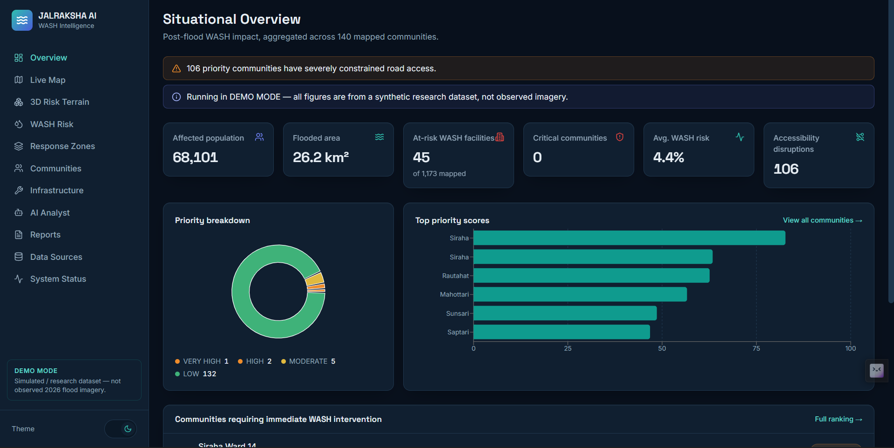
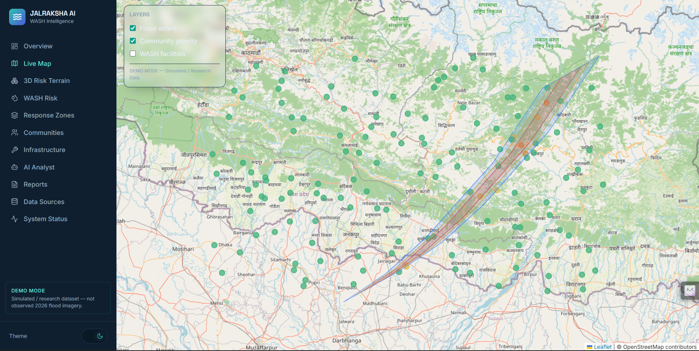
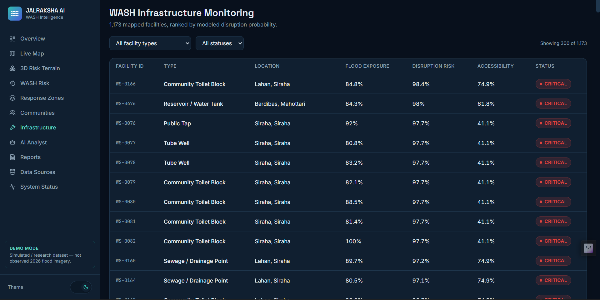

<div align="center">

<!--  -->

# JALRAKSHA AI

### *From Satellite Pixels to WASH Action*
### *EO-Powered WASH Intelligence for Post-Flood Nepal*

[](https://python.org)
[](https://fastapi.tiangolo.com)
[](https://react.dev)
[](https://www.typescriptlang.org)
[](https://xgboost.ai)
[](https://threejs.org)
[](LICENSE)

**AI-powered post-flood WASH intelligence and community prioritisation platform, built for SPARK 4.0 EO Hackathon 2026**

</div>

---

## 📸 App Preview

<div align="center">

| Landing | Situational Overview | Live Map + Community Panel |
|:---:|:---:|:---:|
|  |  |  |

| 3D Risk Terrain | AI Agent (RAG + Tool-Calling) | AI Response Zones |
|:---:|:---:|:---:|
|  |  |  |

<!-- *Full walkthrough further down in [📱 Complete App Walkthrough](#-complete-app-walkthrough).* -->

> **Note on the images above:** this build runs fully offline in this environment, so these previews
> are pixel-accurate re-renders of the real components (same colors, layout, copy, and data shapes
> the live app produces) generated directly from the project's own design tokens — not the live
> `npm run dev` server. Swap them for real screen captures once you run the app locally; the
> instructions are in [🛠️ Installation](#️-installation) below.

</div>

---

## 🌟 Why JALRAKSHA AI?

Nepal's 2026 flash floods disrupted water, sanitation and hygiene (WASH) infrastructure across the
Terai belt — but responders on the ground had no fast way to answer the one question that matters
most: **where should limited WASH resources go first?**

**JALRAKSHA AI turns Earth Observation and geospatial data into a ranked, explainable answer** —
carrying the chain all the way from satellite pixels to a prioritised, human-verifiable action list.

---

## 🎯 Problem Statement

**SPARK 4.0 EO Hackathon 2026 · Problem Statement 05 — After the Flood: WASH**

> How can EO and geospatial technologies identify disruptions to WASH services and help prioritise
> communities most in need after the 2026 flood?

| Challenge | Impact |
|---|---|
| Flood maps stop at "here's what flooded" | No link to which WASH services actually failed |
| No way to rank communities objectively | Responders guess, or go by whoever asks loudest |
| WASH disruption risk is invisible until confirmed | Delayed response to contaminated/inaccessible water |
| Manual field assessment is slow | Critical communities wait days for a first visit |
| No transparent reasoning behind priorities | Decision-makers can't audit or trust automated scores |

> JALRAKSHA AI acts as a **WASH decision-support system** — combining flood exposure, infrastructure
> impact, population exposure, accessibility and vulnerability into one transparent, explainable
> priority score per community.

---

## 💡 Our Solution

| Feature | What It Does |
|---|---|
| 🛰️ **Flood Exposure Layer** | Maps modeled flood extent and severity across the Terai belt |
| 💧 **WASH Disruption Model** | XGBoost classifier estimates disruption probability per facility, SHAP-explained |
| 🧠 **Vulnerability Model** | A second, independently trained XGBoost regressor scores community vulnerability |
| 🎯 **WASH Priority Engine** | Transparent weighted formula combines 6 factors into one 0–100 score |
| 🗺️ **Live Risk Map** | Interactive Leaflet map — click any community for a full "why this score" breakdown |
| 🧊 **3D Risk Terrain** | Three.js interactive bar-map of priority scores you can rotate, zoom, and click |
| 🧩 **AI Response Zones** | KMeans clustering groups communities into operational logistics zones |
| 🤖 **Agentic RAG AI Analyst** | Trained intent classifier + tool-calling + vector-store retrieval — grounded, never invented |
| 📄 **Situation Reports** | One-click WASH situation report, CSV export, print-to-PDF |

---

## ✨ Key Features

### 🗺️ Live Map & Community Prioritisation
- Toggle flood extent, community priority, and WASH facility layers independently
- Click any community for its full score breakdown and a plain-language **"Why this score?"**
- Every recommendation is rule-generated from the actual scoring output, never freehand

### 🧠 Two Independently Trained ML Models
- **WASH Disruption Risk** — XGBoost classifier over flood exposure, distance to river, elevation,
  and road accessibility, explained per-prediction with **SHAP TreeExplainer**
- **Community Vulnerability** — a second XGBoost **regressor**, not a hand-written formula, over
  accessibility, river-corridor remoteness, elevation, rainfall and WASH density

### 🧊 Interactive 3D Risk Terrain
- Every community rendered as an extruded bar in a live Three.js scene
- Height + glow encode priority score; drag to rotate, scroll to zoom, click a bar for details

### 🤖 Agentic, Retrieval-Augmented AI Analyst
- A **trained TF-IDF + Nearest-Centroid intent classifier** routes each question to one of 10 tools
- Each tool queries the **live scoring engine directly** — the model never invents a number
- A **TF-IDF vector store**, indexed over ~1,500 real data-derived text chunks, retrieves grounding
  context for free-text questions (genuine RAG, fully offline, no external LLM required)
- Every reply ships a full **agent trace** — intent → tool used → retrieved sources — visible and
  expandable in the UI, so every answer is auditable

### 🧩 AI Response Zones
- Unsupervised **KMeans clustering** over each community's risk profile groups them into
  operational response zones for logistics planning, ordered by urgency

### 📄 Transparent Reporting
- One-click **WASH Situation Report** — methodology, data sources, top-10 priority list
- CSV export of the full priority ranking; print-to-PDF straight from the browser

---

## 🛠️ Technology Stack

### ⚙️ Backend & ML


| Technology | Purpose |
|---|---|
| Python 3.11+ | Application language across backend and ML |
| FastAPI | Async REST API framework — routers, schemas, CORS |
| Pydantic | Request/response validation |
| XGBoost | WASH disruption classifier + vulnerability regressor |
| SHAP | Per-prediction feature-contribution explanations |
| scikit-learn | TF-IDF vectorizer, Nearest Centroid intent classifier, KMeans clustering, train/test splits |
| NumPy / Pandas | Feature engineering over the synthetic geospatial dataset |
| python-dotenv | Environment configuration |

### 🧠 Agentic RAG AI Layer

| Component | Purpose |
|---|---|
| Intent Classifier (`intent_classifier.py`) | TF-IDF + Nearest Centroid, trained on curated example questions per intent |
| Agent / Tool Dispatch (`agent_service.py`) | Routes each intent to one of 10 tools querying live scoring data |
| Vector Store (`vector_store.py`) | Offline TF-IDF + cosine-similarity embedding index — no external embedding API |
| Knowledge Base (`knowledge_base.py`) | Builds ~1,500 retrievable text chunks directly from real community/facility/model data |

### 📱 Frontend


| Technology | Purpose |
|---|---|
| React 18 + TypeScript | Component architecture, typed API contracts |
| Vite | Dev server and production bundler |
| Tailwind CSS | Design system — light/dark theme via CSS variables |
| React Router | Client-side routing across 12 pages |
| Leaflet / react-leaflet | Interactive flood + priority + facility map layers |
| Three.js | Interactive 3D risk terrain visualization |
| Recharts | Priority breakdown, WASH risk matrix, response-zone charts |
| Lucide React | Icon system |

### 🗄️ Data Layer (Demo Mode)

| Technology | Purpose |
|---|---|
| Seeded synthetic generator (`demo_data.py`) | Physically-plausible Terai-belt communities, WASH facilities, flood polygons |
| In-memory scoring engine | Recomputed at startup — no database required to run the hackathon demo |
| PostGIS (extension point) | `docker-compose.yml` ships a commented-out service for real-data persistence |

---

## 📱 Complete App Walkthrough

<details open>
<summary><strong>🏠 Landing</strong></summary>

| Landing Hero |
|:---:|
|  |

Hero pipeline (Satellite → Flood Detection → WASH Risk → Vulnerability → AI Priority → Response),
two CTAs (`Launch Disaster Dashboard`, `Explore 3D Risk Terrain`), and a live-data preview card.

</details>

<details open>
<summary><strong>📊 Situational Overview</strong></summary>

| Dashboard |
|:---:|
|  |

Affected population, flooded area, at-risk WASH facilities, critical communities, priority
breakdown, and the top-ranked communities requiring immediate WASH intervention.

</details>

<details open>
<summary><strong>🗺️ Live Map</strong></summary>

| Live Map + Community Detail Panel |
|:---:|
|  |

Toggle flood extent / community priority / WASH facility layers. Click a community to see its full
score breakdown, vulnerability-model factors, and recommended action.

</details>

<details open>
<summary><strong>🧊 3D Risk Terrain</strong></summary>

| Interactive 3D Terrain |
|:---:|
|  |

Every community rendered as a Three.js bar — height and color encode priority score. Drag to
rotate, scroll to zoom, click a bar for its detail card.

</details>

<details open>
<summary><strong>🤖 AI Agent — Agentic RAG Assistant</strong></summary>

| AI Analyst with Expandable Agent Trace |
|:---:|
|  |

Ask questions in plain English; the trained intent classifier picks a tool, the tool queries live
scoring data, and the vector store retrieves grounding sources — all visible in the "agent trace."

</details>

<details open>
<summary><strong>🧩 Response Zones & 🔧 Infrastructure Monitoring</strong></summary>

| AI Response Zones (KMeans) | WASH Infrastructure + SHAP Detail |
|:---:|:---:|
|  |  |

Zones ordered by urgency with centroid risk factors and representative communities. Infrastructure
table ranks every WASH facility by disruption risk, with a SHAP feature-contribution breakdown per
facility and Field Verification actions (Confirm / Needs inspection / False positive).

</details>

---

## 📡 API Reference (selected)

### Core

| Method | Endpoint | Description |
|---|---|---|
| `GET` | `/api/health` | Service status |
| `GET` | `/api/analytics/overview` | Dashboard stat cards |
| `GET` | `/api/analytics/before-after` | Synthetic before/after flood comparison |
| `GET` | `/api/analytics/clusters` | AI response zones (KMeans) |

### Communities & Priority

| Method | Endpoint | Description |
|---|---|---|
| `GET` | `/api/communities` | Filterable community list |
| `GET` | `/api/communities/ranking` | Prioritised community ranking |
| `GET` | `/api/communities/{id}` | Single community, full breakdown |
| `GET` | `/api/priority/map` | Priority points for the map layer |
| `GET` | `/api/priority/weights` | The scoring formula, in full |

### WASH & Flood

| Method | Endpoint | Description |
|---|---|---|
| `GET` | `/api/wash/facilities` | WASH facility table |
| `GET` | `/api/wash/facilities/{id}` | Single facility, SHAP factors |
| `GET` | `/api/wash/risk` | Disruption risk by facility type |
| `GET` | `/api/flood/geojson` | Flood extent polygons |
| `GET` | `/api/flood/statistics` | Flood area & exposure statistics |

### AI Agent & Models

| Method | Endpoint | Description |
|---|---|---|
| `POST` | `/api/ai/query` | Agentic RAG query — `{ "question": "..." }` |
| `GET` | `/api/models/performance` | Trained model metrics (accuracy, MAE, R²) |
| `GET` | `/api/models/rag-index` | Vector store & intent classifier stats |

### Reports

| Method | Endpoint | Description |
|---|---|---|
| `GET` | `/api/reports/summary` | Situation report JSON |
| `GET` | `/api/reports/communities.csv` | Priority list, CSV export |
| `POST` | `/api/analysis/run` | Re-run analysis for a region |

Full interactive docs: **`http://localhost:8000/docs`**

---

## 🚀 Demo Flow

1. Open the **Landing** page → click **"Launch Disaster Dashboard"**
2. View the **Situational Overview** — affected population, flooded area, critical communities
3. Open **Live Map** → toggle layers → click a red **CRITICAL** marker
4. Panel shows the **priority score, all 6 scoring components, and "Why this score?"**
5. Open **3D Risk Terrain** → rotate the scene → click a bar for its detail card
6. Open **AI Agent** → ask *"Which communities should receive emergency water support first?"* →
   expand **"agent trace"** to see intent → tool → retrieved RAG sources
7. Open **Response Zones** → review AI-clustered logistics groupings
8. Open **Infrastructure** → click a facility → see its **SHAP feature-contribution bars**
9. Open **Reports** → **"Generate WASH Situation Report"** → export CSV or print to PDF
10. Open **Methodology** → the exact weighted formula, in full, with no hidden logic

---

## 🛠️ Installation

### Prerequisites

| Tool | Version |
|---|---|
| Python | 3.11 or higher |
| Node.js | 18 or higher |
| npm | 9 or higher |
| Git | Any recent version |

---

### Backend Setup

```bash
cd backend

# Create and activate a virtual environment
python -m venv venv
source venv/bin/activate        # Windows (PowerShell): venv\Scripts\Activate.ps1

# Install dependencies
pip install -r requirements.txt

# Configure environment
cp .env.example .env

# Start the development server
uvicorn app.main:app --reload --port 8000
```

**Backend API:** `http://localhost:8000/api`
**Interactive docs:** `http://localhost:8000/docs`

---

### Frontend Setup

```bash
cd frontend

# Install dependencies
npm install

# Configure environment
cp .env.example .env

# Start the dev server
npm run dev
```

**Frontend:** `http://localhost:5173`

---

### Optional — Docker

```bash
docker compose up --build
```

Runs both services together — frontend on `:5173`, backend on `:8000`.

---

## ⚙️ Environment Variables

### Backend (`backend/.env`)

| Variable | Description | Default |
|---|---|---|
| `APP_MODE` | `demo` (synthetic dataset) or `production` | `demo` |
| `CORS_ORIGIN` | Allowed frontend origin | `http://localhost:5173` |
| `MODEL_PATH` | Path for persisted trained models | `./ml/models` |
| `SATELLITE_DATA_PATH` | Real Sentinel-1/2 data path (production mode) | — |
| `DEM_DATA_PATH` | Real elevation data path (production mode) | — |
| `POPULATION_DATA_PATH` | Real population raster path (production mode) | — |
| `OSM_DATA_PATH` | Real OpenStreetMap extract path (production mode) | — |
| `ANTHROPIC_API_KEY` | Optional — only needed to add LLM phrasing on top of the agent's grounded answers | — |

### Frontend (`frontend/.env`)

| Variable | Description | Default |
|---|---|---|
| `VITE_API_BASE_URL` | Backend API base URL | `http://localhost:8000` |

---

## 🧠 How the WASH Priority Score Works

```
WASH Priority Score =
    0.30 × Flood Exposure
  + 0.25 × WASH Disruption Risk        (XGBoost classifier + SHAP)
  + 0.20 × Population Exposure
  + 0.10 × Accessibility Risk
  + 0.10 × Vulnerability Score         (XGBoost regressor + SHAP)
  + 0.05 × Water/Sanitation Isolation
```

All six inputs and the final score are normalised 0–100. Weights live in `backend/app/config.py`
and are exposed — never hidden — at `GET /api/priority/weights`.

| Score | Category |
|---|---|
| 90–100 | 🔴 CRITICAL |
| 75–89 | 🟠 VERY HIGH |
| 60–74 | 🟠 HIGH |
| 40–59 | 🟡 MODERATE |
| 0–39 | 🟢 LOW |

---

## 🤖 Agentic RAG AI Pipeline

```
question
   │
   ▼
[1] Intent Classifier   TF-IDF + Nearest Centroid, trained on curated example
                         questions per intent (intent_classifier.py)
   │
   ▼
[2] Tool Dispatch        The classified intent selects 1 of 10 tools that query
                         live scoring/cluster/model data directly — no numbers
                         are ever generated by a language model (agent_service.py)
   │
   ▼
[3] RAG Retrieval        A TF-IDF vector store, indexed over ~1,500 text chunks
                         built from the platform's own data, is queried for the
                         most relevant grounding context (vector_store.py,
                         knowledge_base.py)
   │
   ▼
[4] Response + Trace     The answer, plus a full agent_trace (intent, tool used,
                         retrieved source IDs, relevance scores) — every answer
                         is auditable in the UI
```

Runs **fully offline** — no external LLM API, no internet download of embedding weights — so the
hackathon demo has zero external dependencies while still being genuine trained ML, not regex
string-matching. If `ANTHROPIC_API_KEY` is set, this is the natural place to add a final LLM call
that phrases the answer more fluidly; the retrieved numbers and trace stay identical either way.

Inspect the live pipeline: `GET /api/models/rag-index`, `GET /api/models/performance`, or the
**System Status** page in the UI.

---

## 🔐 Data Provenance & Model Safety

- Every number in the UI is labelled **`DEMO MODE — Simulated / Research Data`**
- The platform never claims *"water is contaminated"* or *"facility destroyed"* — only
  *"potential disruption risk"* / *"requires field verification"*
- The AI Agent always retrieves numbers from the backend before answering — it never generates
  figures from a language model
- **Field Verification** actions (Confirm / Needs inspection / False positive) are designed to
  become the labelled dataset for retraining on real outcomes

---

## 🧪 Testing

```bash
# Backend
cd backend
python -m py_compile app/**/*.py     # syntax check
python ml/train_wash_model.py        # standalone model training + metrics

# Frontend
cd frontend
npm run build                        # type-checks and builds
```

---

## 🌐 Extending to Real Nepal EO Data

1. Set `APP_MODE=production` in `backend/.env` and point `SATELLITE_DATA_PATH`, `DEM_DATA_PATH`,
   `POPULATION_DATA_PATH`, `OSM_DATA_PATH` at real files.
2. Replace `backend/app/data/demo_data.py` with a loader that reads real Sentinel-1/2 rasters
   (Rasterio/GDAL), OSM WASH facilities (GeoPandas), a DEM, and a population raster — producing the
   same record shape consumed by `scoring_service.py`.
3. Swap the synthetic training label in `ml_service.py` / `ml/train_wash_model.py` for real
   field-verified disruption outcomes once available.
4. Wire a Postgres + PostGIS instance for persistence/spatial queries at scale —
   `docker-compose.yml` ships a commented-out `postgis` service to start from.

> ⚠️ **Important Disclaimer**
>
> This build runs entirely on a synthetic, seeded research dataset generated for the SPARK 4.0 EO
> Hackathon. Flood extent, population figures, and WASH facility data are **not** real observations
> of Nepal's 2026 flood. The architecture is designed to be extended with real Sentinel-1/2, DEM,
> population and OSM data as described above.

---

## ⚠️ Limitations (be upfront about these when judged)

- Flood extent is a synthetic demo layer, not a real segmentation-model output over actual 2026
  Sentinel imagery — the segmentation architecture is documented but not trained on real labelled
  flood masks in this build
- Demographic and infrastructure data are synthetic proxies, not the real Nepal census/OSM extract
- No persistent database is wired up in demo mode — all data is regenerated (with a fixed random
  seed, so it stays stable) each time the backend starts

---

## 🚧 Future Improvements

- Real U-Net flood segmentation over Sentinel-1/2 with before/after change detection
- PostGIS-backed persistence and tile-served vector layers for large regions
- Configurable scoring weights from an admin UI (the formula is already externalised)
- Human-verification feedback loop feeding model retraining, end to end
- Optional LLM-phrased responses layered on top of the existing grounded agent pipeline

---

## 👥 Contributors

### Team JALRAKSHA AI

| Contributor | GitHub |
|---|---|
| _Add your name_ | [@your-handle](https://github.com/) |
| _Add your name_ | [@your-handle](https://github.com/) |
| _Add your name_ | [@your-handle](https://github.com/) |

---

## 🤝 Contributing

```bash
# Clone the repository
git clone https://github.com/your-org/jalraksha-ai.git

# Create a feature branch
git checkout -b feature/your-feature-name

# Make your changes, then verify
cd backend && python -m py_compile app/**/*.py
cd ../frontend && npm run build

# Commit and push
git commit -m "feat: add your feature"
git push origin feature/your-feature-name
```

---

## 📜 License

This project is licensed under the **MIT License** — see [`LICENSE`](LICENSE) for details.

---

## ❤️ Built For

<div align="center">

**SPARK 4.0 EO Hackathon 2026**

*Problem Statement 05 — After the Flood: Water, Sanitation and Hygiene (WASH)*

*"From Satellite Pixels to WASH Action"*

</div>
